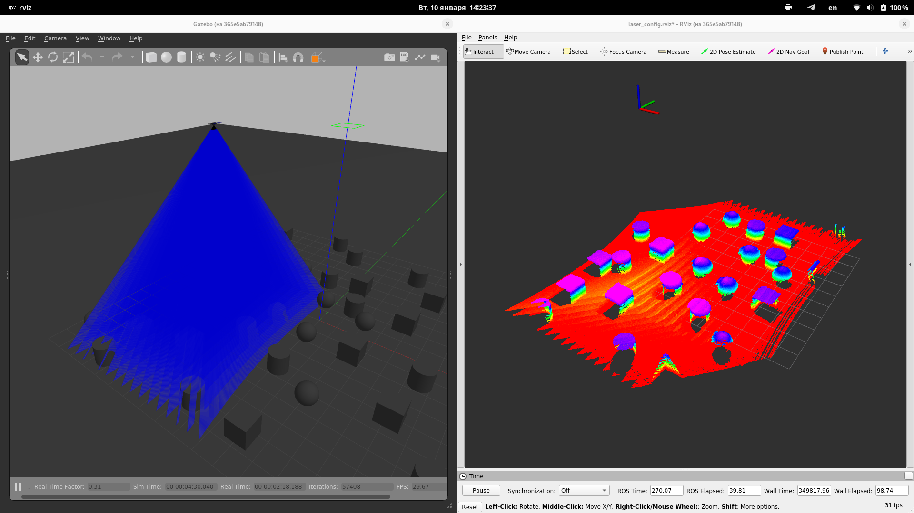
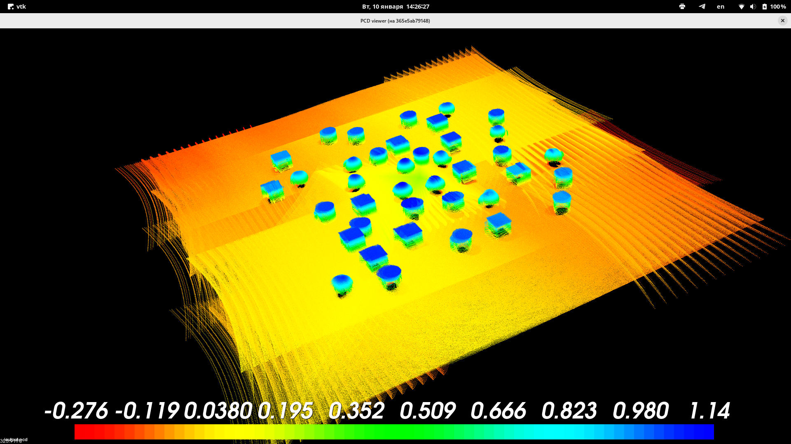

# lars-gazebo-dem
Дрон с лидаром и три карты:  
* __MAP_N55E106__ - построена по карте высот (9x9 км)  
* __MAP_N56E110__ - построена по карте высот (9x9 км)  
* __test_lidar__ - карта для теста лидара, плоскость с расставленными в случайном порядке кубами, цилиндрами и сферами

## Зависимости
* [ROS Noetic](http://wiki.ros.org/noetic)
* [common_msgs](http://wiki.ros.org/common_msgs?distro=noetic)
* [geometry2](http://wiki.ros.org/geometry2?distro=noetic)
* [Catkin Command Line Tools](https://catkin-tools.readthedocs.io/en/latest/) - для сборки пакетов в `lars_gazebo_dem_ws/`
* [drone-api](https://github.com/boris-gu/drone-api) - для запуска теста laser_test.py
* pcl-tools - для работы с файлами .pcd

## Подготовка
* Установите плагин, симулирующий работу многолучевого лидара, и публикующий с него данные:
    ```bash
    sudo apt install ros-noetic-velodyne-gazebo-plugins
    ```
* Так как PX4-Autopilot быстро развивается, за основу взята стабильная версия 1.13.1.  
    Клонировать:  
    ```bash
    git clone --recurse-submodules --branch v1.13.1 https://github.com/PX4/PX4-Autopilot.git
    ```

    Добавьте модель, запустив `<PATH_TO_THIS_REP>/2px4/setup.sh <PATH_TO_PX4>`. Этот скрипт внесет все необходимые изменения в PX4-Autopilot.
* Соберите пакет __lars_gazebo_dem__
    ```bash
    cd <PATH_TO_THIS_REP>/lars_gazebo_dem_ws
    catkin build
    ```
* Для корректной работы лидара необходимо настроить преобразование фреймов __map->base_link__.  
    В файле __px4_config.yaml__ (скорее всего будет лежать по пути `/opt/ros/noetic/share/mavros/launch/`) установите `send` на `true` в следующем куске кода:
    ```yaml
    # local_position
    local_position:
    frame_id: "map"
    tf:
        send: true
        frame_id: "map"
        child_frame_id: "base_link"
        send_fcu: false
    ```
* При первом запуске симуляции необходимо настроить следующие параметры через QGroundControl:  
    __MPC_XY_VEL_MAX__ = 1 м/с - ограничить скорость дрона для более плотного сканирования лидаром  
    __COM_RCL_EXCEPT__ = 4 - Offboard


## Запуск
```bash
cd <PX4-Autopilot_clone>
DONT_RUN=1 make px4_sitl_default gazebo
source ~/catkin_ws/devel/setup.bash    # (optional)
source <PATH_TO_THIS_REP>/lars_gazebo_dem_ws/devel/setup.bash # LaserScan -> PointCloud2
source Tools/setup_gazebo.bash $(pwd) $(pwd)/build/px4_sitl_default && \
export ROS_PACKAGE_PATH=$ROS_PACKAGE_PATH:$(pwd) && \
export ROS_PACKAGE_PATH=$ROS_PACKAGE_PATH:$(pwd)/Tools/sitl_gazebo
roslaunch px4 MAP_N55E106.launch
# или
# roslaunch px4 MAP_N56E110.launch
# или
# roslaunch px4 test_lidar.launch
```
Если необходимо запустить дрон в пустом мире, воспользуйтесь командой:
```bash
roslaunch px4 mavros_posix_sitl.launch vehicle:=iris_lidar_lars_dem
# Запустите в отдельном терминале для возможности просматривать данные с лидара
tf2_ros static_transform_publisher 0 0 -0.045 0 1.5707 0 base_link laser_frame
```

## Данные с дрона
Для просмотра данных лидара запустите RViz с конфигом __laser_config.rviz__
```bash
rviz -d <PATH_TO_THIS_REP>/laser_config.rviz
```



Для сохранения данных выполните в отдельном терминале:
```bash
# Создате папку для файлов с облаками точек
mkdir ./pcd
cd ./pcd
# Сохраните облака точек (каждый кадр - отдельный файл)
# Для окончания записи нажмите Ctrl+C
rosrun pcl_ros pointcloud_to_pcd input:=/laser_pc2
# Объедините файлы в output.pcd
pcl_concatenate_points_pcd *.pcd
# Посмотреть результат
pcl_viewer ./output.pcd
```


